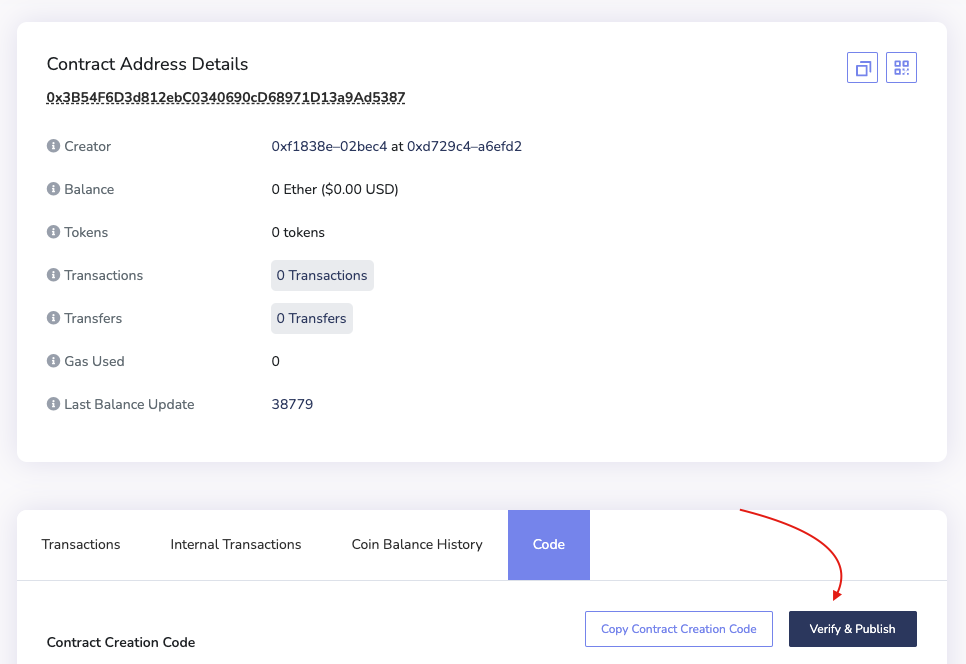

# 🗞️ Contract build on zkSync ZK rollup layer2 solution 🗞️
> There is one contract Greeter.sol to be deployed to zkSync. Instructions how to deploy and verify contract on zkSync explorer below


## 📁 Table of Contents
* [General Info](#-general-information)
* [Technologies Used](#-technologies-used)
* [Features](#-features)
* [Requirements For Initial Setup](#-requirements-for-initial-setup)
* [Setup](#-setup)
* [Contact](#-contact)


## 🚩 General Information
- Contract allows users to set and get greeting message on zkSync network

 
## 💻 Technologies Used
- zksync-web3 library
- layer2 zk rollup

## 🌟 Features
ZK-Rollup has absolute dominance in user experience, which can be concretely expressed as a :
- high level of security, 
- fast
- economic transactions.

## 👀 Requirements For Initial Setup
- Install [yarn](https://classic.yarnpkg.com/lang/en/docs/install)
- Install [Docker](https://www.docker.com/products/docker-desktop/)

## 📟 Setup
### 1. 💾 Clone/Download the Repository
### 2. 📦 Install Dependencies:
```
$ cd repository_file
$ yarn
```
### 3. 🔍  .env environment variables required to set up
Create .env file inside project folder

- You can get your private key from your wallet(⚠️Don't share your private key with untrusted parties) 
```
PRIVATE_KEY = <Private key of your wallet u want to deploy contracts from>
```


### 4. 📁 Run Compile
```
$ yarn hardhat compile
```

### 5. 🚀 Deploy to zkSync ( ⚠️ Make sure to have ETH on your wallet in GOERLI testnet ⚠️)
```
$ yarn hardhat deploy-zksync
``` 

### 7. 📜 Verify contracts
- 🔎 Go to [zkScan](https://zksync2-testnet.zkscan.io/#) explorer and find your deployed contract.
- ☑️ Go to "Сode" tab and click "Verify & Publish":

- 🤔 Choose how you want to verify: Via flattened source code || Via Standard Input JSON.
- ✅ Enter the required data and you have successfully verified your contract.


## 💬 Contact
Created by [@LESKOV](https://www.linkedin.com/in/ivan-leskov-4b5664189/) - feel free to contact me!

